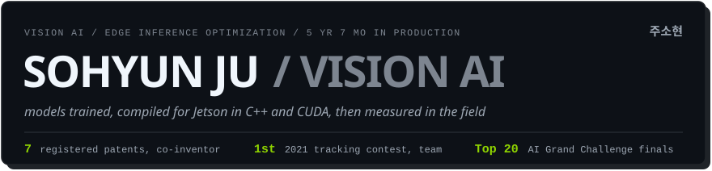
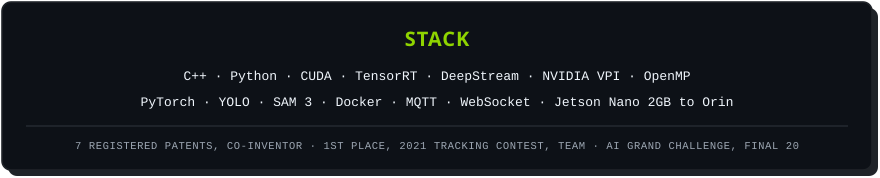

<picture>
  <source media="(prefers-color-scheme: dark)" srcset="assets/0-hero-dark.svg">
  
</picture>

<a href="mailto:cannonvirus@gmail.com"><picture><source media="(prefers-color-scheme: dark)" srcset="assets/link-mail-dark.svg"></picture></a>
<a href="https://velog.io/@juju2123/posts"><picture><source media="(prefers-color-scheme: dark)" srcset="assets/link-velog-dark.svg"></picture></a>
<picture><source media="(prefers-color-scheme: dark)" srcset="assets/link-now-dark.svg"></picture>

<picture>
  <source media="(prefers-color-scheme: dark)" srcset="assets/1-peoplecount-pipeline-dark.svg">
  
</picture>

<picture>
  <source media="(prefers-color-scheme: dark)" srcset="assets/2-measured-reconnect-dark.svg">
  
</picture>

<picture>
  <source media="(prefers-color-scheme: dark)" srcset="assets/4-count-architecture-dark.svg">
  
</picture>

<picture>
  <source media="(prefers-color-scheme: dark)" srcset="assets/5-throughput-labeling-dark.svg">
  
</picture>

<picture>
  <source media="(prefers-color-scheme: dark)" srcset="assets/7-base-also-dark.svg">
  
</picture>

<picture>
  <source media="(prefers-color-scheme: dark)" srcset="assets/9-stack-dark.svg">
  
</picture>

<b>글로 읽기</b>: 프로젝트별 담당 영역과 결과

 

**People Count, 급식장 대기열 분석** &nbsp;|&nbsp; 2025.06 – 2025.12 &nbsp;|&nbsp; 삼성웰스토리 오픈 이노베이션 6기 과제

- 영상 입력부터 검출, 추적, 구역별 집계, 비식별화, 통신까지 혼자 설계하고 구현했습니다. 대시보드는 디자이너, 프론트엔드 개발자와 협업했습니다.
- C++ 기반 DeepStream 파이프라인과 VPI 가속 블러 플러그인을 구현해, 전체 프레임 비식별화를 적용한 5채널 영상을 채널당 20 fps로 처리했습니다.
- 사람이 가려질 때 축소된 검출 박스를 복원해 추적 ID가 바뀌는 문제에 대응했습니다. 카운팅 정확도는 96.4%로, 3개월간 점심 이용 인원을 식수 태깅기 로그와 대조했습니다.
- RTSP 입력마다 프레임 유입을 감시해 장애가 난 채널만 분리한 뒤 다시 연결했습니다. 실제 연결이 끊겼을 때도 나머지 채널의 집계는 유지됐습니다.

**EdgeFarm Count, 영상 기반 체중 측정과 마릿수 집계** &nbsp;|&nbsp; 2021 – 2025 &nbsp;|&nbsp; 국내외 농장 상용 제품에 적용

- 카메라 높이에 따른 화소와 실측 단위의 환산 기준을 만들고, 상관관계와 공선성을 분석해 입력 변수를 선별했습니다. 같은 개체의 연속 관측값으로 체중을 예측하는 Transformer 계열 모델을 설계했습니다.
- TensorRT 변환 코드를 작성하고 출력 디코딩과 NMS를 CUDA로 구현했습니다. 면적과 몸통 등고선 계산은 OpenMP로 병렬 처리했습니다.
- Orin Nano 4GB에서 일반 출하 시 30–60 fps, 자돈 60–70마리 동시 통과 시 10 fps로 처리했습니다. 영상 입력부터 분석 결과를 영상에 표시하기까지 지연이 누적되지 않도록 했습니다.
- 회전 상자와 중심점 거리로 개체를 추적하고 여러 집계선의 결과를 종합해 카운팅 정확도 99.8%를 확보했습니다. 출하성적서의 실제 마릿수를 기준으로 검증했습니다.
- 실증 실패 당시의 영상을 개체별 실측 체중과 연결해 보존했습니다. 약 1년 뒤 재촬영 없이 학습에 활용했고, 이후 국가 주관 비접촉 체중계 실험에서 40두의 개체 체중 오차율 평균 5%로 인증을 통과했습니다.
- 한돈협회 실증에서 이동 방향에 따라 체중이 달라진다는 피드백을 받았습니다. 해당 농장에는 같은 무리가 좌우로 이동할 때 체중 편차가 2% 이내인 모델을 선정해 배포했습니다.

**학습 자동화와 엣지 공통 기능**

- 현장 조건에 맞는 공개 데이터가 없어 영상에서 이미지를 추출하고 SAM 3 라벨링을 거쳐 YOLO를 학습하는 과정을 Python으로 자동화했습니다. 하루 약 1만 장의 라벨을 다시 생성하고 실제 카운팅 정확도로 모델 교체를 판단했습니다.
- 각 Jetson에서 엔진을 빌드하는 라이브러리를 구현해 장비별 TensorRT 엔진 차이에 대응하고, Docker로 버전별 환경을 분리했습니다. 팀원들도 다른 제품에 이 라이브러리를 사용했습니다.
- 처리 속도에 맞춰 입력 프레임 수를 조절해 대기열이 가득 차기 전에 부하를 낮췄습니다. 프레임이 한꺼번에 버려져 추적이 끊기는 문제에 대응하도록 People Count와 EdgeFarm Grow에 적용했습니다.

**EdgeFarm Grow, 성장 상태 측정과 현장 데이터 분석**

- 활동량과 식사시간을 측정하는 기능을 개발했습니다. 태국 돈방 4곳의 약 2개월 데이터를 분석해 돈방별 활동량과 증체량의 상관계수 -0.84를 확인했습니다. 체중 사분위 범위가 날짜에 따라 변하는 정도를 성장 격차 지표로 제안해 적용했습니다.
- 결과를 로컬 로그에 저장한 뒤 10분 간격으로 업로드하고, 네트워크 단절로 전송에 실패한 기록은 다시 보내도록 했습니다. 전송 작업은 별도 스레드에서 실행했습니다.

**Facepection, 열화상 기반 온도 측정**

- 온도 측정을 전담해 일반 카메라와 열화상 카메라의 좌표를 맞췄습니다. 직접 측정한 데이터로 거리와 기온에 따른 온도 보정 알고리즘을 설계했으며, 접촉식 체온계와 대조한 오차는 0.3°C 이내였습니다.

**VISER, 뉴스레터 기반 기술 탐색 개인비서** &nbsp;|&nbsp; 개인 프로젝트, 개발 중 &nbsp;|&nbsp; Python, SQLite, LLM 연동

- 뉴스레터를 수집해 보고서를 만들고, 등록한 업무 문제에 관련 기사와 근거를 연결하는 개인비서를 개발했습니다. 원문과 처리 실패 기록을 보존해 다시 처리할 수 있도록 했습니다. 기술의 적용 가능성을 검토하고 실험 결과를 다음 탐색에 반영하는 자동화 기능은 설계 중입니다.

**특허 및 대외 활동**

- 등록 특허 7건에 공동 발명자로 참여했습니다. 담당한 기술 영역에서 아이디어를 제안하고 명세서 초안을 작성했습니다.
- 2021 추적 영상 인식 알고리즘 개발 경진대회에서 팀 1위를 기록했습니다. 검출 모델 학습과 데이터 증강, 후처리를 담당했습니다. 주최: 과학기술정보통신부, 한국지능정보사회진흥원
- AI 그랜드 챌린지 수학 문제 풀이 부문에서 계산 유형을 먼저 분류한 뒤 계산하는 구조를 제안하고 구현했습니다. 본선 20팀에 진입했으며 후속 연구 과제 수주에 기여했습니다.

**학력 및 자격**

- 전남대학교 통계학과 경제학 복수전공, 학사, 2013.03 – 2019.08, 학점 3.81 / 4.5
- 정보처리기사 2019.05, ADsP 데이터분석 준전문가 2019.07

