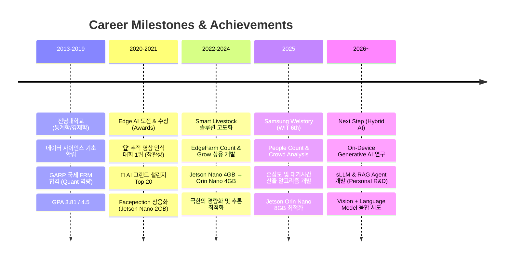

# Hi there, I'm Sohyun Ju 

  

  <h3>⚡ "Maximum Intelligence, Minimum Resources"</h3>
  
<i>"Simplicity is the ultimate sophistication (단순함은 궁극의 정교함이다)" - Leonardo da Vinci</i>

  <h2>🌟 Senior Edge AI Engineer | System Architect | Optimization Expert 🌟</h2>
  <h3>🚀 Embedded AI Solutions | ⚡ High-Performance Computing | 👁️ Real-time Vision Analytics</h3>

  

  
  
  

  

## 🚀 About Me

저는 **6년 이상의 AI/ML 경험**(Since 2020)을 보유한 **AI Engineer**이자, **Smart Livestock(가축)** 도메인의 **실시간 영상 분석 전문가**입니다.

주로 **Edge Device** 환경에서 **객체 탐지(Detection), 추적(Tracking), 카운팅** 및 **혼잡도 측정** 알고리즘을 최적화하여 구현합니다. 특히 데이터 수집부터 **전처리(Filtering)**, 학습, **후처리**까지 이어지는 **AI 개발 전주기(Full-cycle) 자동화** 파이프라인 구축에 깊은 전문성을 가지고 있습니다.

### 🎯 Current Focus
- 🌱 **Smart Livestock & Crowd AI**: 가축 행동 분석 및 **개체 추적(Tracking)**, **인파 혼잡도(Crowd Density)** 측정 알고리즘 고도화
- 🚀 **Edge Optimization**: **NVIDIA Jetson** 환경에서의 실시간 추론을 위한 모델 경량화 및 고속화
- 📱 **End-to-End Pipeline**: 데이터 수집부터 **전처리(Filtering)**, 학습, **후처리**까지 이어지는 자동화 프로세스 구축
- 🔮 **Personal R&D (GenAI)**: **sLLM** 기반의 **Game Agent** 및 **RAG** 룰 에이전트 개발을 통한 **On-Device AI** 기술 확장

### 🏆 Engineering Excellence & Awards

- 🥇 **2021 추적 영상 인식 대회 1위 (최우수상)**
  - **과학기술정보통신부** 주최 | 데이터 편향 문제를 해결하는 독자적 증강 알고리즘 개발
  - 현장의 CCTV 데이터 특성을 분석하여 **객체 추적(Tracking)** 성능을 극대화

- 🥈 **인공지능 그랜드 챌린지 Top 20 (수학 문제 풀이 부문)**
  - **과학기술정보통신부** 주최 | **후속 연구비 2억 3,750만 원** 확보
  - 문제 유형을 자동 분류하고 최적의 솔버를 매칭하는 **하이브리드 아키텍처** 설계

- 🎓 **전남대학교 통계학/경제학 학사 (2013-2019)**
  - GPA: **3.81/4.5**
  - **Data Science Foundation**: 통계적 추론과 데이터 분석 이론을 AI 모델링에 접목

## 📈 Career Journey

## 🛠️ Technical Expertise

### Core Specializations

<b>⚡ Edge AI & System Architecture</b>

- **Hardware Acceleration**: **NVIDIA Jetson** (Orin Nano/NX, Nano) 임베디드 리눅스 환경 완벽 제어
- **Inference Optimization**:
  - **TensorRT** (FP16/INT8 양자화) 기반의 모델 경량화 및 추론 가속
  - 전/후처리 병목 제거를 위한 **CUDA Kernel** 직접 구현 및 최적화
  - Python 로직의 **C++ Native Plugin** 포팅을 통한 시스템 고속화
- **Pipeline Orchestration**:
  - **DeepStream SDK** & **GStreamer**를 활용한 다채널 실시간 영상 분석
  - **Zero-Copy** (NVMM) 메모리 제어로 Latency 최소화
- **Robust Engineering**:
  - 24/7 무인 운영을 위한 **Self-Healing (Watchdog)** 및 장애 자동 복구 시스템
  - 네트워크 단절 시 데이터 무결성을 보장하는 **Store & Forward** 아키텍처

<b>👁️ Computer Vision & Advanced Analytics</b>

- **Target Domains**:
  - **Smart Livestock**: 가축 행동 분석, 비접촉 체중 추정, 이상 징후 모니터링
  - **Crowd Analytics**: 피플 카운팅, **혼잡도(Congestion)** 및 대기시간 산출 알고리즘
- **Core Algorithms**:
  - **Multi-Object Tracking (MOT)**: Kalman Filter 튜닝 및 ID Switching 최소화 전략
  - **Anomaly Detection**: 노이즈가 심한 현장 데이터에서의 실시간 이상 감지
- **Statistical AI Approach**:
  - **약지도 학습(Weakly Supervised)**을 통한 데이터 부족 문제 해결
  - 도메인 지식과 통계적 직관을 결합한 **커스텀 손실 함수(Loss Function)** 설계
- **Auto-Labeling Ops**: 데이터 수집부터 전처리, 재학습까지 이어지는 **MLOps 파이프라인** 자동화

### Tech Stack

#### 🛠️ Languages

#### ⚡ Edge AI & Acceleration

#### 👁️ Vision Models & Tracking

 

#### 📡 Backend & Cloud Pipeline

#### 🤖 AI Productivity & Tools

 Profile design inspired by <a href="https://github.com/umitkacar">Umit Kacar</a> 
